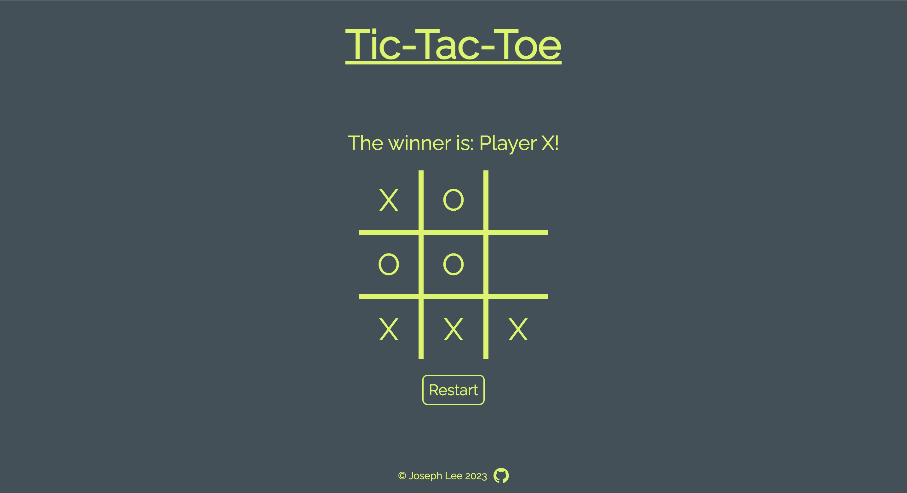

# Tic-Tac-Toe

My implementation of the [Tic-Tac-Toe project](https://www.theodinproject.com/lessons/node-path-javascript-tic-tac-toe) for [The Odin Project](https://www.theodinproject.com/). Try it [here](https://jooo-lee.github.io/tic-tac-toe/)!

## Description:

This Tic-Tac-Toe game is designed to be played by two players in the web browser. The player with marker "X" goes first, with the players alternating turns. The game ends when one player wins by placing 3 markers in a row or there is a tie because all of the squares are filled but there is no 3 in a row.

## Features:

-   Player turn announcement
-   Game over announcement (win or tie)
-   Restart button

## I learned how to:

-   Generate new objects using factory functions
-   Avoid polluting the global namespace by encapsulating using the module pattern (IIFEs)
-   Use closures to create private variables

## Acknowledgements:

[Favicon](https://icons8.com/icon/jXwk1Wlvjo6P/tic-tac-toe) from [Icons8](https://icons8.com).
